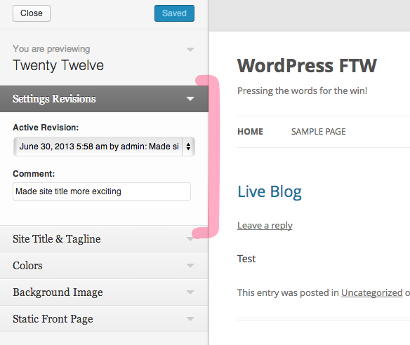
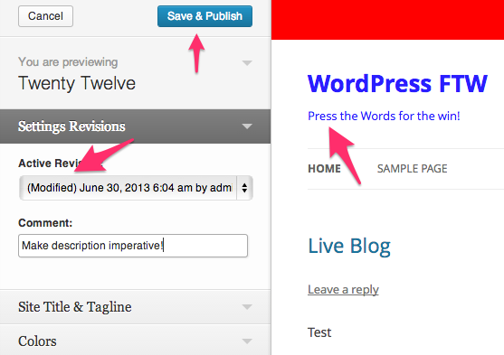
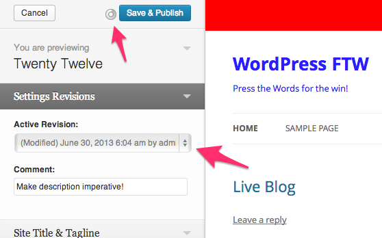
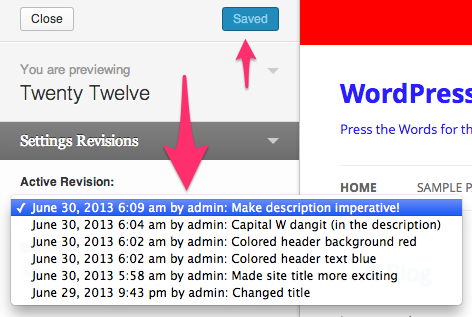
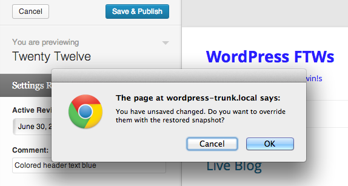

<!-- DO NOT EDIT THIS FILE; it is auto-generated from readme.txt -->
# Settings Revisions

Keep revisions of changes to your settings in Theme Customizer, and preview rollbacks to their previous states.

**Contributors:** [x-team](http://profiles.wordpress.org/x-team), [westonruter](http://profiles.wordpress.org/westonruter)  
**Tags:** [customizer](http://wordpress.org/plugins/tags/customizer), [customize](http://wordpress.org/plugins/tags/customize), [options](http://wordpress.org/plugins/tags/options), [settings](http://wordpress.org/plugins/tags/settings), [theme-mods](http://wordpress.org/plugins/tags/theme-mods), [revisions](http://wordpress.org/plugins/tags/revisions), [versioning](http://wordpress.org/plugins/tags/versioning), [revert](http://wordpress.org/plugins/tags/revert), [styles](http://wordpress.org/plugins/tags/styles)  
**Requires at least:** 3.5  
**Tested up to:** 3.6.1  
**Stable tag:** trunk (master)  
**License:** [GPLv2 or later](http://www.gnu.org/licenses/gpl-2.0.html)  

## Description ##

***Now compatible with PHP≥5.2!***

One of the greatest features of WordPress is the **Customizer** which allows you to change settings and preview them in real-time, all before you publish them for everyone to see. (Go ahead and click that big **Customize Your Site** button on your Dashboard!) But what if you make a change and want to go back in time to restore your previous settings? Changes to posts can be previewed ([mostly](http://core.trac.wordpress.org/ticket/20299)), and they have revisions which allow you to revert the current version to restore a previous one. *The same revision system is needed for settings.* This is what the Settings Revisions plugin implements.

In the Customizer, a new section appears at the top called “Settings Revision” and inside of it appears a dropdown of all revisions in the system, showing when they were made, who made them, and what changes were made. A text field appears below which allows users to supply a commit message.

Once installed, also check out the [Widget Customizer](http://wordpress.org/plugins/widget-customizer/) plugin which brings sidebars and widget form controls into the Customizer, allowing you to edit widgets and preview them just like you do for any other settings in the Customizer.  With the Settings Revisions and Widget Customizer plugins combined, you get **widget revisions**. Also try Settings Revisions with the [Styles](http://wordpress.org/plugins/styles/) plugin.

You can access the Customizer by clicking the “Customize Your Site” button on your Dashboard, by accessing the **Appearance > Customize** menu item in the admin, or on the front-end of your site by clicking the “Customize” sub-menu item in the admin bar. You can also install the [Customizer Everywhere](http://wordpress.org/plugins/customizer-everywhere/) plugin which makes the Customizer more accessible and integrates it with post previewing.

**Development of this plugin is done [on GitHub](https://github.com/x-team/wp-settings-revisions). Pull requests welcome. Please see [issues](https://github.com/x-team/wp-settings-revisions/issues) reported there before going to the plugin forum.**

## Screenshots ##

### Collapsed customizer section

### Expanded customizer section

### Open dropdown of revisions

### Change setting starts new revision

### Revision select during save

### New revision prepended to list

### Selecting previous revision loads old settings into customizer for preview before saving

### Confirmation when restoring revision atop unsaved changes

## Changelog ##

### 0.2 ###
* Eliminate PHP 5.3 requirement by removing namespaces and closures ([#22](https://github.com/x-team/wp-settings-revisions/issues/22))
* Fix PHP_CodeSniffer issues according to the [WordPress Coding Standards](https://github.com/WordPress-Coding-Standards/WordPress-Coding-Standards) ([#17](https://github.com/x-team/wp-settings-revisions/issues/16)), add to Travis and `pre-commit`
* Add jshint to Travis and `pre-commit` hook ([#17](https://github.com/x-team/wp-settings-revisions/issues/17))
* Improve pre-commit hook to optionally scan modified files

### 0.1.3 ###
Fix handling of settings which contain PHP-serialized values; use `customize_controls_enqueue_scripts` action.

### 0.1.2 ###
Correct method for updating customizer, by updating settings not by updating controls.

### 0.1.1 ###
Eliminate strict standards notice
Fix customizer control

### 0.1.0 ###
First Release

