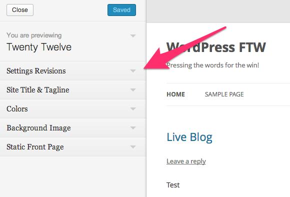
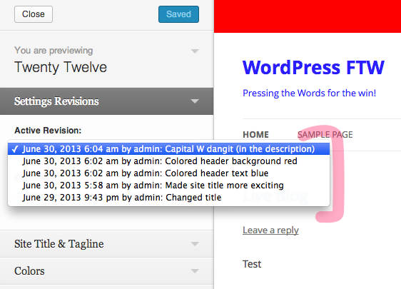
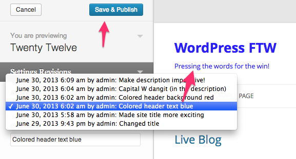

<!-- DO NOT EDIT THIS FILE; it is auto-generated from readme.txt -->
# Settings Revisions

Keep revisions of changes to your settings, now specifically those exposed in Theme Customizer. Roll back to a previous state of your settings.

**Contributors:** [x-team](http://profiles.wordpress.org/x-team), [westonruter](http://profiles.wordpress.org/westonruter)  
**Tags:** [customizer](http://wordpress.org/plugins/tags/customizer), [options](http://wordpress.org/plugins/tags/options), [settings](http://wordpress.org/plugins/tags/settings), [theme-mods](http://wordpress.org/plugins/tags/theme-mods), [revisions](http://wordpress.org/plugins/tags/revisions)  
**Requires at least:** 3.5  
**Tested up to:** 3.6-beta3  
**Stable tag:** trunk (master)  
**License:** [GPLv2 or later](http://www.gnu.org/licenses/gpl-2.0.html)  

## Description ##

Development of plugin is done on GitHub: [https://github.com/x-team/wp-settings-revisions](https://github.com/x-team/wp-settings-revisions)

Pull requests welcome.

Requires PHP 5.3!

## Screenshots ##

### Collapsed customizer section

### Expanded customizer section

### Open dropdown of revisions

### Change setting starts new revision

### Revision select during save

### New revision prepended to list

### Selecting previous revision loads old settings into customizer for preview before saving

### Confirmation when restoring revision atop unsaved changes

## Changelog ##

### 0.1.0 ###
First Release

